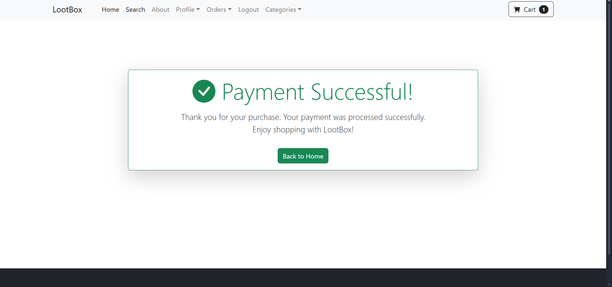

# Django E-commerce Project

This is a full-featured e-commerce web application built with Django and Bootstrap. The project includes core functionalities such as product listing, cart management, and secure checkout with Stripe.

---

## Live Demo

👉 [Click here to view the live project](https://django-ecommerce-production-96f5.up.railway.app)

---

## Features

* User registration and authentication
* Product detail and category views
* Search functionality
* Cart operations (add, update, remove)
* Secure checkout with Stripe payment integration
* Order confirmation and cancellation pages

---

## Technologies Used

* Python
* Django
* Bootstrap
* Stripe API
* HTML / CSS / JavaScript

---

## Installation

1. Clone the repository:

   ```bash
   git clone https://github.com/Selinoztrk/Django-Ecommerce.git
   cd Django-Ecommerce/djangoecom
   ```

2. Create and activate a virtual environment:

   ```bash
   python -m venv env
   source env/bin/activate  # On Windows: env\Scripts\activate
   ```

3. Install dependencies:

   ```bash
   pip install -r requirements.txt
   ```

4. Create a `.env` file in the root directory and add your Stripe keys:

   ```env
   STRIPE_SECRET_KEY=your_secret_key
   STRIPE_PUBLISHABLE_KEY=your_publishable_key
   ```

5. Apply database migrations:

   ```bash
   python manage.py migrate
   ```

6. Run the development server:

   ```bash
   python manage.py runserver
   ```

---

## Deployment

This project is deployed using [Railway](https://railway.app).

* Environment variables such as `STRIPE_SECRET_KEY` and `STRIPE_PUBLISHABLE_KEY` are set in the Railway dashboard.
* The production domain is added to `ALLOWED_HOSTS` in `settings.py`.

---

## Project Structure

```
djangoecom/
├── cart/
├── djangoecom/
├── media/
│   └── uploads/
│       └── product/
├── payment/
├── screenshots/
├── static/
├── staticfiles/
├── store/
├── manage.py
├── requirements.txt
```

---

## Screenshots

### Home Page


### Product Detail


### Cart Page


### Payment Success



---

## Architecture Overview

Below is a high-level diagram of the project architecture:

```text
[User Interface]
     |
     v
[Django Views] <-> [Templates (HTML/CSS/Bootstrap)]
     |
     v
[Models] <-> [Database (SQLite/PostgreSQL)]
     |
     v
[Stripe API] <-- Payment Processing
```

---

## License

This project is intended for personal, academic, and portfolio use only.
